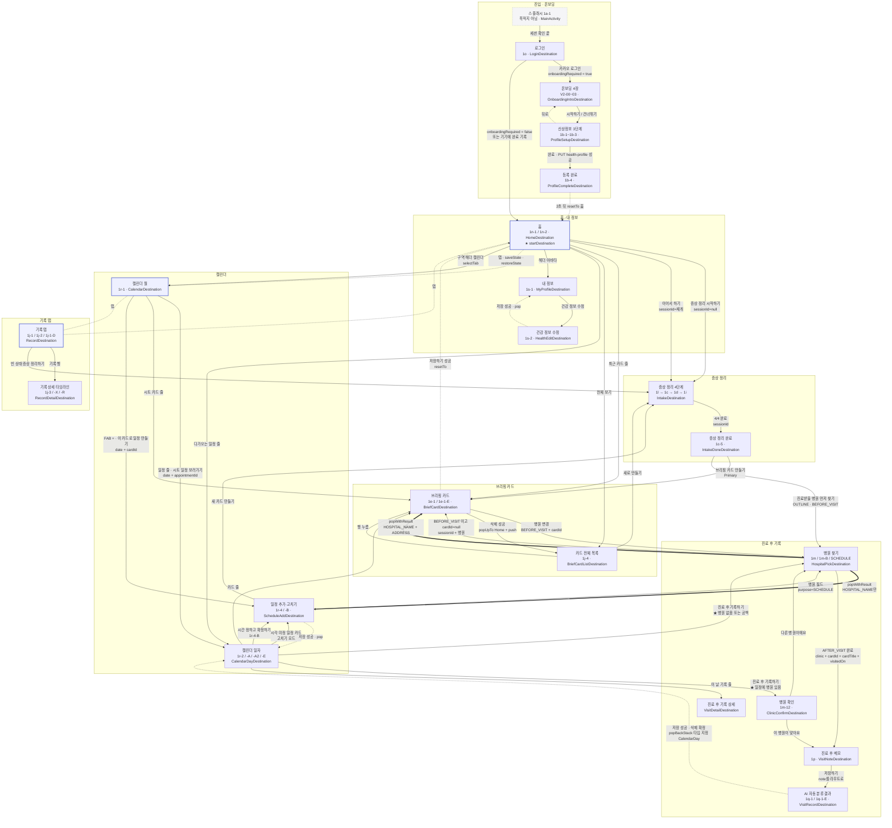
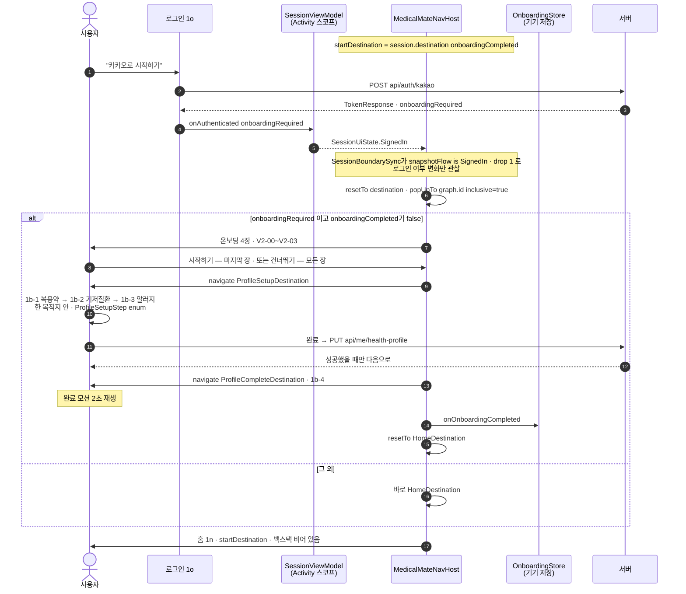
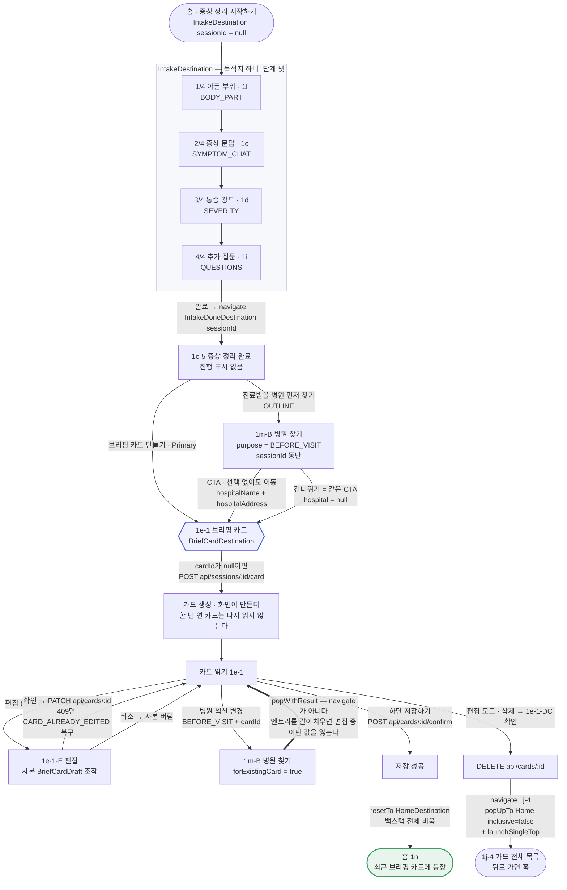
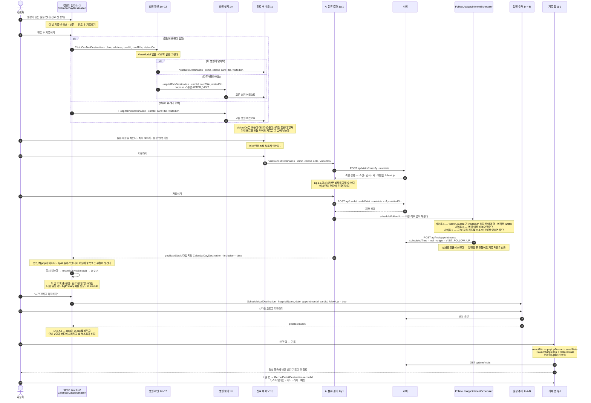

# 화면 지도 · 사용자 플로우

> 이 문서가 읽은 것: `docs/android-analysis/00~13` 전 14개 도메인 명세 + 안드로이드 원본
> `C:/Claude/MedicalMate/app/src/main/java/com/mist/medicalmate/navigation/` 4개 파일 전부
> (`MedicalMateNavHost.kt` · `MedicalMateNavGraphs.kt` · `MedicalMateNavTransitions.kt` · `NavResult.kt`)
> 와 각 기능 패키지의 `*Destination.kt` 21개.
>
> 도메인 문서가 화면 **하나하나**를 파고든다면 이 문서는 그 화면들이 **어떻게 이어지는지**만 본다.
> 화면 내부 규격(레이아웃·문구·상태 필드)은 각 도메인 문서를 본다.

---

## 0. 먼저 — 목적지는 **21개**다 (요청의 "23개"와 다름)

`composable<T>` 등록을 전수 세면 **21개**다. 근거는 §6의 전수 대조표.

두 수가 갈리는 이유를 짚어 두면:

| 세는 법 | 개수 | 설명 |
| --- | --- | --- |
| **`composable<T>` 등록 수 (= 라우트 수)** | **21** | 이 문서의 기준. `grep -rn "composable<" app/src/main/java`가 22줄인데 그중 1줄은 `LoginDestination.kt:14`의 **KDoc 본문**이다 |
| 화면 정체성 기준 | **23** | `HospitalPickDestination` 하나가 `purpose` 값으로 **세 자리**(1m 진료 후 · 1m-B 진료 전 · SCHEDULE 일정 추가)를 맡는다. 이 셋을 각각 세면 `21 − 1 + 3 = 23` |

요청한 "23개"는 **후자의 세는 법**과 정확히 맞는다. 이 문서의 §1 표는 21개 목적지를 행으로 두되
`HospitalPickDestination` 행에 세 자리를 모두 적어서 **두 세는 법 모두 검증되게** 했다.

**덧붙여 — 소스 주석이 낡았다.** `MedicalMateNavGraphs.kt:49`의 KDoc이
`"목적지가 열아홉이 되면서 한 파일에 함수가 열하나가 됐고"`라고 적혀 있다. 지금은 열아홉이
아니라 **스물하나**다. `ClinicConfirmDestination`(#246)과 `VisitDetailDestination`(#256)이
그 주석 이후에 들어왔다. 웹앱으로 옮길 때 이 주석을 그대로 번역하지 말 것.

---

## 1. 전체 화면 목록

### 1.1 네비게이션 목적지 21개 — 마스터 표

`하단 탭` 열: `MedicalMateTabBar`를 **실제로 그리는** 화면만 ✓다. 원본에서 이 컴포넌트를 부르는
곳은 `HomeScreen.kt` · `CalendarMonthScreen.kt:110` · `RecordScreen.kt:79` **세 곳뿐**이다.

`데모` 열: `artifacts/demo-20260915/medicalmate-demo-full.mp4`(3분 54초) 기준.
✓ = `00-video-observations.md`에 전용 관찰 절이 있음 / △ = 흐름상 통과했으나 관찰 절 없음 / ✗ = 미등장.

| # | Figma id | 화면 이름 | 라우트 (직렬화 클래스) | 웹 경로 제안 | 도메인 | 하단 탭 | 데모 |
|---|---|---|---|---|---|:---:|:---:|
| 1 | `1o` → V2 `1320:4558` | 로그인 | `LoginDestination` *(object)* | `/login` | auth | — | ✗ |
| 2 | `V2-00`~`V2-03` `1320:4570` `1320:4605` `1320:4635` `1320:4675` | 온보딩 4장 | `OnboardingIntroDestination` *(object)* | `/onboarding` | profile | — | ✓ f002~f008 |
| 3 | `1b-1` `398:1225` · `1b-2` `398:1285` · `1b-3` `398:1341` | 신상정보 입력 3단계 | `ProfileSetupDestination` *(object)* | `/profile-setup` | profile | — | ✓ f009~f013 |
| 4 | `1b-4` `676:2519` | 신상정보 등록 완료 | `ProfileCompleteDestination` *(object)* | `/profile-setup/done` | profile | — | ✓ f020 |
| 5 | `1n-1` `399:1339` · `1n-2` `399:1720` | 홈 | `HomeDestination` *(object)* | `/` | home | **✓ 홈** | △ (1b-4 뒤 자동 전환으로 통과) |
| 6 | `1l` `1c` `1d` `1i` — `1c-1` `402:1629` · `1c-2` `402:1506` · `1d` `402:1934` · `1i` `489:5606` | 증상 정리 4단계 | `IntakeDestination(sessionId: Long? = null)` | `/intake` | intake | — | ✓ f021~f042 |
| 7 | `1c-5` `1041:3655` | 증상 정리 완료 | `IntakeDoneDestination(sessionId: Long? = null)` | `/intake/done` | intake | — | △ (f042→f044 사이) |
| 8 | `1e-1` `404:1679` · `1e-1-E` `597:4804` · `1e-1-DC` | 브리핑 카드 (읽기/편집) | `BriefCardDestination(cardId: String?, sessionId: Long?, hospitalName: String?, hospitalAddress: String?)` | `/card/:cardId` | card | — | ✓ f056 f062 f064 |
| 9 | `1j-4` `1122:4830` · `1j-4-D2` | 브리핑 카드 전체(목록) | `BriefCardListDestination` *(object)* | `/cards` | card | — | ✗ |
| 10 | `1j-1` `406:2569` · `1j-2` `406:2646` · `1j-1-D` `1121:4527` | 기록 탭 | `RecordDestination` *(object)* | `/record` | card | **✓ 기록** | ✓ f110 |
| 11 | `1j-3` `735:3829` · `1j-3-X` `1038:2768` · `1j-3-R` `1039:2799` | 기록 상세 (타임라인) | `RecordDetailDestination(recordId: String)` | `/record/:recordId` | card | — | ✓ f114 |
| 12 | `1s-1` `407:2375` | 내 정보 | `MyProfileDestination` *(object)* | `/me` | profile | — | ✗ |
| 13 | `1s-2` `407:2650` | 건강 정보 수정 | `HealthEditDestination` *(object)* | `/me/health` | profile | — | ✗ |
| 14 | `1r-1` `406:2310` · 시트 `1r-1-S` `1226:4669` | 캘린더 월 | `CalendarDestination` *(object)* | `/calendar` | calendar | **✓ 캘린더** | ✓ f065 f066 |
| 15 | `1r-2` `406:2514` · `1r-2-A` `1060:2879` · `1r-2-A2` `1060:2998` · `1r-2-E` | 캘린더 일자 | `CalendarDayDestination(date: String, appointmentId: Long? = null)` | `/calendar/:date` | calendar | — | ✓ f088 f098 f105 |
| 16 | `1r-4` `1062:3031` · `1r-4-B` · `1r-4-C` · 시트 `1r-4-D` `1063:3131` · `1r-4-T` `1063:3372` | 일정 추가 / 고치기 | `ScheduleAddDestination(hospitalName: String?, date: String?, appointmentId: Long?, cardId: String?, followUp: Boolean)` | `/schedule/new` | calendar | — | ✓ f074 |
| 17 | **1m** `489:5447` (진료 후)<br>**1m-B** `1041:3687` (진료 전)<br>**1m-B/SCHEDULE** (일정 추가에서) | 병원 찾기 — **한 목적지, 세 자리** | `HospitalPickDestination(purpose: HospitalPickPurpose, cardId: String?, cardTitle: String?, sessionId: Long?, visitedOn: String?)` | `/hospital?purpose=` | visit | — | ✓ f044 f050 *(1m-B)* |
| 18 | `1m-12` `1576:8517` | 병원 확인 | `ClinicConfirmDestination(clinic: String, address: String?, cardId: String, cardTitle: String, visitedOn: String)` | `/visit/clinic-confirm` | visit | — | △ (f088→f092 사이) |
| 19 | `1p` `1185:12667` | 진료 후 메모 | `VisitNoteDestination(clinic: String?, cardId: String?, cardTitle: String?, visitedOn: String?)` | `/visit/note` | visit | — | ✓ f092 |
| 20 | `1q-1` `405:2193` · `1q-1-E` `636:3675` · `1q-1-DC` | AI 자동 분류 결과 | `VisitRecordDestination(clinic: String?, cardId: String?, note: String, visitedOn: String?)` | `/visit/record` | visit | — | ✓ f095 |
| 21 | 1q-1과 같은 카드 | 진료 후 기록 상세 (저장본) | `VisitDetailDestination(visitId: String)` | `/visit/:visitId` | visit | — | ✗ |

**도메인별 집계**: profile 5 · visit 5 · card 4 · calendar 3 · intake 2 · auth 1 · home 1 = **21**

**데모 등장 집계**: ✓ 13 · △ 3 · ✗ 5 = 21
- △ 3개 = 홈(5) · 증상 정리 완료(7) · 병원 확인(18). 흐름상 반드시 지나갔지만
  `00-video-observations.md`에 전용 관찰 절이 없다(각각 f020→f021 · f042→f044 · f088→f092 구간).
- ✗ 5개 = 로그인(1) · 카드 목록(9) · 내 정보(12) · 건강 정보 수정(13) · 진료 후 기록 상세(21).
  **데모 준비 시 이 5개는 실기기 확인이 안 된 화면**이라는 뜻이다.

### 1.2 목적지 하나가 여러 화면을 그리는 경우 — 갈래 표

Figma 화면 수(= 시안의 프레임 수)와 라우트 수가 어긋나는 지점이다. **웹에서 URL을 나눌지
말지를 여기서 결정한다.**

| 목적지 | 갈래 수 | 무엇이 가르는가 | 웹에서 URL을 나눌까 |
| --- | :---: | --- | --- |
| `IntakeDestination` | 4 | `IntakeStep` enum — `BODY_PART`(1l) → `SYMPTOM_CHAT`(1c) → `SEVERITY`(1d) → `QUESTIONS`(1i) | **나누지 않는다.** 뒤로가기가 4겹 쌓이고 중간 답이 날아간다 |
| `ProfileSetupDestination` | 3 | `ProfileSetupStep` enum — 복용약(1b-1) → 기저질환(1b-2) → 알러지(1b-3) | **나누지 않는다.** 위와 같은 이유 |
| `OnboardingIntroDestination` | 4 | `OnboardingPage` enum — V2-00~V2-03 | **나누지 않는다.** 신상정보로 나간 뒤에도 4장이 뒤에 남는다 |
| `HospitalPickDestination` | **3** | `HospitalPickPurpose` — `AFTER_VISIT`(1m) · `BEFORE_VISIT`(1m-B) · `SCHEDULE` | 라우트 값이므로 **쿼리로 유지**. 셋의 CTA 라벨과 나가는 길이 전부 다르다 |
| `BriefCardDestination` | 2 | `editing` 불리언 — 1e-1 읽기 / 1e-1-E 편집 | **나누지 않는다.** URL을 나누면 취소했을 때 카드가 그대로 남지 않는다 |
| `VisitRecordDestination` | 2 | 같은 이유 — 1q-1 / 1q-1-E | **나누지 않는다** |
| `RecordDestination` | 3 | 목록(1j-1) / 빈 상태(1j-2) / 편집(1j-1-D) — 상태 갈래 | 나누지 않는다 |
| `BriefCardListDestination` | 2 | 목록 / 편집(1j-4-D2) | 나누지 않는다 |
| `CalendarDayDestination` | 4 | 진료 전(1r-2) / 진료 완료 시간 미정(1r-2-A) / 확정(1r-2-A2) / 편집(1r-2-E) — 전부 **서버 데이터로 갈리는 것**이지 사용자가 고르는 것이 아니다 | 나누지 않는다 |
| `HomeDestination` | 2 | `savedCards`·`upcoming`이 둘 다 비었나 — 1n-1 / 1n-2 | 나누지 않는다 |

### 1.3 목적지가 아닌 화면 — 표에 없는 이유

| 화면 | Figma | 정체 | 왜 목적지가 아닌가 |
| --- | --- | --- | --- |
| 스플래시 | `1a-1` → V2 `1320:4553` | `MainActivity`의 `SplashScreen` API | `NavHost`가 그리지 않는다. `SessionUiState.Checking`/`RestoreFailed`를 여기서 잡아 그래프까지 오지 않게 한다 |
| 카드만 있는 날 시트 | `1r-1-S` `1226:4669` | 캘린더 월 위의 `MedicalMateBottomSheet` | 같은 화면의 오버레이 |
| 날짜 선택 시트 | `1r-4-D` `1063:3131` | 일정 추가 위의 시트 | 같은 화면의 오버레이 |
| 시간 선택 시트 | `1r-4-T` `1063:3372` | 일정 추가 위의 시트 | 같은 화면의 오버레이 |
| 삭제 확인 대화상자 (4곳) | `1e-1-DC` · `1q-1-DC` · 기록 탭(1j-1-D) · 카드 목록(1j-4-D2) | `MedicalMateDialog` | 같은 화면의 오버레이 |

> `dialog<T>` · `bottomSheet<T>` 등록은 **하나도 없다**(전수 grep 결과 0건). 시트와 다이얼로그는
> 전부 화면 내부 상태(`sheet != null`, `deleteRequested == true`)로 그린다. 웹에서도 URL을
> 만들지 말 것 — 뒤로가기가 시트만 닫는 동작은 별도로 구현해야 한다.

---

## 2. 전체 네비게이션 그래프

실선 = `navigate` (백스택 push) · 굵은 점선 = `popWithResult` (**값만 돌려주고 뒤로**) ·
점선 = `popBackStack` / `resetTo` 계열.



### 그래프에서 읽어야 할 다섯 가지

1. **두 길이 카드에서 만난다.** 1c-5에서 바로 카드로 가든 1m-B를 들렀다 가든 **카드를 만드는
   자리는 `BriefCardDestination` 하나**다. 카드를 1c-5에서 만들지 않는 이유가 이것이다
   (`MedicalMateNavGraphs.kt:95` 주석).
2. **병원 찾기는 나가는 길이 네 갈래**고, 그중 **둘은 `navigate`가 아니라 `popWithResult`**다
   (굵은 점선). 엔트리를 갈아치우면 앞 화면의 ViewModel이 정리되면서 적어 둔 날짜·시간·할 일이
   사라진다(`NavResult.kt` KDoc).
3. **진료 후 기록 흐름의 되돌아오는 자리는 `CalendarDayDestination`**이고, 한 단계 pop이 아니라
   **타입 지정 pop**(`popBackStack<CalendarDayDestination>(inclusive = false)`)이다. 한 단계만
   돌아가면 1p에서 다시 저장해 **지운 기록이 되살아나거나 중복 저장된다**.
4. **`ClinicConfirmDestination`(1m-12)은 캘린더 일자에서만 들어온다.** 일정에 병원이 이미 있을
   때 아는 것을 다시 찾게 하지 않으려는 화면이다(#246).
5. **`RecordDetailDestination`(1j-3)은 나가는 길이 뒤로가기 하나뿐**이다. 카드 단계에서
   브리핑 카드로 건너가던 것을 1j-3-X(그 자리에서 펴 보기)가 대체했다 —
   *"눌러도 아무 일이 없는 줄을 두지 않는다"*(#79).

---

## 3. 핵심 사용자 여정 3개

### A. 신규 가입 → 온보딩 → 홈

**핵심**: 로그인 화면이 `navigate`하지 않는다. 세션 상태만 바꾸고 **그래프가 두 곳에서**
목적지를 정한다.



**웹으로 옮길 때 반드시 지킬 3가지**

| 원본 동작 | 웹 대응 |
| --- | --- |
| `resetTo`가 `popUpTo(graph.id){inclusive=true}`로 백스택을 비운다 | `router.push`가 아니라 **`router.replace` + 히스토리 정리**. 뒤로가기로 인증 전 화면이 나오면 안 된다 |
| `SessionBoundarySync`가 **로그인 여부만** 관찰한다 | 목적지 전체를 관찰하면 온보딩을 마치는 순간 이동이 한 번 더 나가고, 1b-4의 `resetTo(홈)`을 덮어써 **등록 완료 토스트가 사라진다** |
| 목적지가 pop될 때 ViewModel이 확실히 정리된다 | 로그아웃 시 **화면 단위 상태를 언마운트에서 반드시 버릴 것**. 전역 store에 남기면 다음 계정에 이전 계정 데이터가 보인다 |

---

### B. 증상 정리 → 병원 찾기 → 브리핑 카드 → 저장

**핵심**: 1c-5에서 갈린 두 길이 **카드 화면 하나**에서 만난다. 그리고 `BEFORE_VISIT` 안에서도
`cardId` 유무로 **navigate냐 pop이냐**가 갈린다.



**웹으로 옮길 때 반드시 지킬 3가지**

| 원본 동작 | 웹 대응 |
| --- | --- |
| `if (uiState is Content) return` — **한 번 연 카드는 다시 읽지 않는다** | 카드를 고치면 서버가 새 버전을 만들어 **`cardId`가 달라진다.** 라우트에 박힌 옛 id로 재조회하면 옛 버전이 돌아와 버전이 가지를 친다. → **라우트 키로 마운트된 인스턴스가 살아 있는 동안 재조회 금지.** `useEffect` 의존성 배열이 재조회를 유발하지 않게 할 것 |
| 병원 `변경`은 `navigate`가 아니라 `popWithResult` | 카드 화면을 언마운트하지 말고 **값만 돌려받을 것**. 언마운트하면 편집 중이던 KV Row가 전부 날아간다 |
| `IntakeDoneScreen`은 `sessionId == null`이면 `return@composable` | **빈 화면이 된다**(NavBar조차 없다). 웹에서는 **라우트 가드로 되돌려보낼 것** |
| `IntakeUiState.completed`가 소비 후에도 남으면 재진입 시 즉시 다시 이동 | 언마운트에서 상태를 버리거나 `completed`를 소비 후 false로 되돌릴 것 |

---

### C. 캘린더 일정 → 진료 후 메모 → AI 분류 → 재방문 확정 → 기록 탭

세 여정 중 가장 길고, **저장이 마지막 화면에서 딱 한 번** 일어난다.



**웹으로 옮길 때 반드시 지킬 4가지**

| 원본 동작 | 웹 대응 |
| --- | --- |
| `VisitRecordDestination.note`가 **라우트 파라미터**다 | 300자 원문이 쿼리 문자열이 된다. **라우터 state 또는 `sessionStorage` 키 하나**로 바꾸되, **새로고침으로 값이 날아가면 1p로 되돌리는 폴백**을 넣을 것. 안드로이드는 프로세스 종료 시에도 라우트가 복원돼 이 문제가 없다 |
| `popBackStack<CalendarDayDestination>(inclusive=false)` | 웹 history에는 타입 기반 pop이 없다. **흐름 시작 시 돌아갈 경로를 명시적으로 들고 다니다가 `router.replace(그 경로)`.** 한 단계만 뒤로 가면 안 된다 |
| 캘린더 일자의 줄 탭이 **두 곳으로 갈린다** | 이 날 기록 줄 → `VisitDetailDestination`(그 기록 하나) / 기록 **탭**의 줄 → `RecordDetailDestination`(1j-3 타임라인). **같은 "기록"인데 목적지가 다르다**(#256) |
| 재방문 일정은 서버가 아니라 **앱이** 만든다 | AI가 날짜를 잘못 뽑아도 조용히 일정이 생기면 안 된다는 판단. 웹에서도 클라이언트가 만들고, 중복 확인 조회가 실패하면 **일정이 하나 더 생기는 알려진 한계**까지 같이 옮길지 결정할 것 |

---

## 4. 하단 탭 구조와 탭 간 백스택 규칙

### 4.1 탭은 셋, 홈이 가운데

`MedicalMateTabBar` — Figma `319:1026`. **선언 순서가 화면 순서**다.

| 위치 | `MedicalMateTab` | 라벨 | 목적지 | 아이콘 (비활성 / 활성) |
|:---:|---|---|---|---|
| 왼쪽 | `CALENDAR` | 캘린더 | `CalendarDestination` | `calendar` / `calendar-filled` |
| **가운데** | `HOME` | 홈 | `HomeDestination` | `home` / `home-filled` |
| 오른쪽 | `RECORD` | 기록 | `RecordDestination` | `note` / `note-filled` |

- **`DESIGN.md`가 `내 정보`를 넣어 넷으로 적은 것은 문서 오류**라고 소스에 명시돼 있다.
  `user`/`user-filled` 아이콘은 세트에 있지만 탭에 쓰이지 않는다. 내 정보(1s-1)는
  **홈 헤더의 아바타**에서 들어간다.
- 마스터의 네 번째 variant(`Active=Active4`, `1223:14193`)는 네 번째 탭이 아니라 **아무 탭도
  활성이 아닌 상태**다. 쓰는 화면이 없다 → 웹에서도 `selected`를 nullable로 만들지 말 것.
- 전체 높이 **79** = 1(경계선) + 8(위 여백) + 46(탭) + 24(safe bottom).
- **활성 표시를 셋 함께** 쓴다(색만 바꾸면 색각 이상에서 전달되지 않는다):
  ① 채움 아이콘 교체 ② 색 `--fg-primary`(비활성 `--fg-subtle`) ③ 라벨 SemiBold.
- **1Depth에서만 노출한다.** 흐름 안에 들어간 화면(문답·카드 작성·병원 찾기·메모)에서는 감춘다.
  탭바를 그리는 화면은 §1.1 표의 ✓ 셋뿐이다.

### 4.2 탭 간 백스택 규칙

`MedicalMateNavHost.kt`의 `NavHostController.selectTab`이 전부다.

```kotlin
internal fun NavHostController.selectTab(tab: MedicalMateTab) {
    val destination = when (tab) {
        MedicalMateTab.RECORD -> RecordDestination
        MedicalMateTab.HOME -> HomeDestination
        MedicalMateTab.CALENDAR -> CalendarDestination
    }
    navigate(destination) {
        popUpTo(graph.findStartDestination().id) { saveState = true }
        launchSingleTop = true
        restoreState = true
    }
}
```

| 옵션 | 무엇을 막는가 / 무엇을 살리는가 |
| --- | --- |
| `popUpTo(startDestination) { saveState = true }` | **탭은 서로의 형제다.** 옮길 때마다 쌓으면 뒤로가기가 탭 방문 이력을 되짚는다. 시작 목적지(= **홈**)까지 pop하되 떠나는 탭의 상태를 **저장**한다 |
| `restoreState = true` | 돌아왔을 때 **스크롤 위치와 고른 날**이 남아 있다 |
| `launchSingleTop = true` | 같은 탭을 다시 눌렀을 때 같은 화면이 두 장 쌓이는 것을 막는다 |

**따라오는 성질 4가지**

1. **시작 목적지는 홈이다.** `popUpTo(startDestination)`이 홈까지 pop한다는 뜻이고, 그래서
   어느 탭에 있든 시스템 뒤로가기는 **홈**으로 간다(홈에서는 앱 종료).
2. **탭 이동은 백스택에 쌓이지 않는다.** 캘린더 → 기록 → 캘린더로 옮겨도 깊이는 1이다.
3. **홈의 구역 헤더 "캘린더"도 `selectTab`**이다(`navigate`가 아니다). 같은 자리로 가는 길이
   둘이면 한쪽만 백스택에 쌓이는 어긋남이 생긴다.
4. **홈의 "다가오는 일정 줄"은 `selectTab`이 아니라 `navigate`**다 — `CalendarDayDestination`
   (1r-2)으로 **바로 들어간다**. 일자 화면은 탭이 아니므로 push가 맞다.

### 4.3 백스택을 비우는 두 자리

| 호출 | 어디서 | 옵션 | 이유 |
| --- | --- | --- | --- |
| `resetTo(HomeDestination)` | 1b-4 완료 · 카드 저장하기 성공 | `popUpTo(graph.id) { inclusive = true }` + `launchSingleTop` | 끝난 흐름을 뒤로가기로 다시 밟으면 같은 것을 두 번 저장한다 |
| `resetTo(session.destination(...))` | `SessionBoundarySync` — 로그인/로그아웃 | 위와 같음 | 뒤로가기로 로그아웃 전 화면이 나오면 인증이 끝난 화면을 인증 없이 보게 된다 |
| `navigate(BriefCardListDestination) { popUpTo<HomeDestination> { inclusive = false } }` | 카드 삭제 성공 | `launchSingleTop` | 지운 카드의 화면에 남을 수 없다. 홈까지만 걷어내고 목록을 얹어 **뒤로 가면 홈**이 나오고 목록이 두 장 쌓이지 않게 한다 |
| `popBackStack<CalendarDayDestination>(inclusive = false)` | 1q-1 저장 성공 · 삭제 확정 | — | 한 단계 pop이면 1p로 돌아가 중복 저장/부활이 생긴다 |

> **`NavHost`를 세션 상태로 갈아치우지 않는다.** `NavHost`는 컴포지션을 떠날 때 아무것도
> 정리하지 않고(`onDispose {}`), 목적지별 `ViewModelStore`가 Activity 스토어에 얹혀 있다.
> 갈아치우면 로그아웃마다 ViewModel이 정리되지 않고 쌓인다. **백스택에서 pop될 때만 확실히
> 정리되므로** 경계 이동을 `resetTo`의 `popUpTo(inclusive)`로 처리한다.

---

## 5. 화면 전환 애니메이션 규격

출처: `navigation/MedicalMateNavTransitions.kt` **전문을 읽고 값까지 옮김**.

### 5.1 상수 두 개

```kotlin
/** Material의 표준 전환 시간. 기본값 700은 한 화면 넘기는 데 길다. */
private const val DURATION = 320

/** 물러나는 화면이 움직이는 몫. 앞의 화면이 네 배 더 움직인다. */
private const val PARALLAX = 4
```

| 상수 | 값 | 의미 |
| --- | --- | --- |
| `DURATION` | **320** (ms) | navigation-compose 기본값은 **700ms 크로스페이드**다. 화면이 어느 쪽으로 갔는지가 남지 않아 되짚는 느낌이 없고, 700은 한 화면 넘기는 데 길다 |
| `PARALLAX` | **4** | 물러나는 화면은 **폭의 1/4만** 움직인다. 둘이 같은 거리를 움직이면 두 장이 나란히 흐르는 것으로 보이고, **뒤에 있는 것이 덜 움직여야 앞뒤가 읽힌다** |
| easing | `FastOutSlowInEasing` | Compose의 표준. = `cubic-bezier(0.4, 0.0, 0.2, 1.0)` |

> 소스가 못 박아 둔 사실: **"디자인 문서에 화면 전환 규격이 없다. 시간과 easing은 Material의
> 표준 전환 값이다."** 즉 320/4는 시안이 준 값이 아니라 구현이 고른 값이다.

### 5.2 네 갈래 전환 — 정확한 오프셋

`slideInHorizontally`/`slideOutHorizontally`의 람다는 **화면 폭(`it`)을 받아 오프셋을 돌려준다.**
`+` 는 오른쪽, `−` 는 왼쪽이다.

| 콜백 | 언제 | 슬라이드 오프셋 | 함께 거는 것 | CSS 환산 (폭 W) |
| --- | --- | --- | --- | --- |
| `enter` | 새 화면이 들어올 때 | `slideInHorizontally { it }` → **+W → 0** | `fadeIn` | `translateX(100%) → 0`, `opacity 0 → 1` |
| `exit` | 물러나는 화면 | `slideOutHorizontally { -it / PARALLAX }` → **0 → −W/4** | `fadeOut` | `translateX(0) → -25%`, `opacity 1 → 0` |
| `popEnter` | 되돌아와 다시 보이는 화면 | `slideInHorizontally { -it / PARALLAX }` → **−W/4 → 0** | `fadeIn` | `translateX(-25%) → 0`, `opacity 0 → 1` |
| `popExit` | 되돌아가며 나가는 화면 | `slideOutHorizontally { it }` → **0 → +W** | `fadeOut` | `translateX(0) → 100%`, `opacity 1 → 0` |

네 갈래 전부 `tween(320, FastOutSlowInEasing)`이다. **되돌아올 때는 들어갈 때를 그대로 뒤집은
것**이고, 그래서 새 화면이 오른쪽에서 들어오고 되돌아갈 때 오른쪽으로 나간다.

### 5.3 탭끼리는 **아무것도 하지 않는다**

```kotlin
private fun AnimatedContentTransitionScope<NavBackStackEntry>.betweenTabs(): Boolean =
    initialState.destination.isTab() && targetState.destination.isTab()

private fun NavDestination.isTab(): Boolean = hasRoute(HomeDestination::class) ||
    hasRoute(CalendarDestination::class) ||
    hasRoute(RecordDestination::class)
```

네 콜백 전부 첫 줄이 `if (betweenTabs())`이고, 참이면 `EnterTransition.None` /
`ExitTransition.None`을 돌려준다.

**이유**(소스 주석 그대로): *"세 탭은 서로의 형제이고 백스택에도 쌓이지 않는다. 미는 전환은
들어가고 나오는 깊이를 말하는 것이라, 같은 층을 옮기는 데 쓰면 캘린더에서 기록으로 가는 것이
한 단계 들어가는 것처럼 보인다."*

> **떠나는 곳과 닿는 곳이 둘 다 탭일 때만**이다. 홈 → 브리핑 카드는 한쪽만 탭이므로 슬라이드가
> 걸린다.

### 5.4 가장자리 스와이프(predictive back)도 **같은 전환**

```kotlin
val predictivePopEnter: AnimatedContentTransitionScope<NavBackStackEntry>.(Int) -> EnterTransition =
    { popEnter() }
val predictivePopExit: AnimatedContentTransitionScope<NavBackStackEntry>.(Int) -> ExitTransition =
    { popExit() }
```

- 인자로 오는 스와이프 방향(`Int`)을 **쓰지 않고** `popEnter()`/`popExit()`를 그대로 돌려준다.
- **돌아가는 길이 하나여야 한다.** 쓸어서 돌아간 것과 눌러서 돌아간 것이 다르게 움직이면
  같은 동작이 두 가지로 보인다.
- **기본값의 축소(scale)를 걷어냈다** — *"화면이 작아져 사라지는 것으로 읽혀서"*.
- 쓸어내는 동안에는 전환이 **손가락 위치만큼만** 진행되고, 놓으면 남은 만큼이 이어서 돈다.

### 5.5 `NavHost` 배선 (여섯 줄 전부)

```kotlin
NavHost(
    navController = navController,
    startDestination = session.destination(onboardingCompleted),
    modifier = modifier,
    enterTransition = MedicalMateNavTransitions.enter,
    exitTransition = MedicalMateNavTransitions.exit,
    popEnterTransition = MedicalMateNavTransitions.popEnter,
    popExitTransition = MedicalMateNavTransitions.popExit,
    predictivePopEnterTransition = MedicalMateNavTransitions.predictivePopEnter,
    predictivePopExitTransition = MedicalMateNavTransitions.predictivePopExit,
) { … }
```

**목적지별 오버라이드가 하나도 없다.** 21개 목적지가 전부 같은 전환을 쓴다.

### 5.6 웹 이식 — 바로 붙일 수 있는 형태

```css
:root {
  --nav-duration: 320ms;
  --nav-easing: cubic-bezier(0.4, 0, 0.2, 1);   /* FastOutSlowInEasing */
  --nav-parallax: 25%;                           /* 100% / PARALLAX(4) */
}

/* push — 새 화면이 오른쪽에서 */
.nav-enter        { transform: translateX(100%);              opacity: 0; }
.nav-enter-active { transform: translateX(0);                 opacity: 1;
                    transition: transform var(--nav-duration) var(--nav-easing),
                                opacity   var(--nav-duration) var(--nav-easing); }
.nav-exit         { transform: translateX(0);                 opacity: 1; }
.nav-exit-active  { transform: translateX(calc(-1 * var(--nav-parallax))); opacity: 0;
                    transition: transform var(--nav-duration) var(--nav-easing),
                                opacity   var(--nav-duration) var(--nav-easing); }

/* pop — 위를 그대로 뒤집는다 */
.nav-pop-enter        { transform: translateX(calc(-1 * var(--nav-parallax))); opacity: 0; }
.nav-pop-enter-active { transform: translateX(0);             opacity: 1; /* transition 동일 */ }
.nav-pop-exit         { transform: translateX(0);             opacity: 1; }
.nav-pop-exit-active  { transform: translateX(100%);          opacity: 0; /* transition 동일 */ }

/* 탭 ↔ 탭 — 전환 없음 */
.nav-tab-switch, .nav-tab-switch * { transition: none !important; animation: none !important; }

@media (prefers-reduced-motion: reduce) {
  [class*="nav-"] { transition: none !important; }
}
```

**웹에서 추가로 챙길 것**

| 항목 | 내용 |
| --- | --- |
| 물러나는 화면을 **언마운트하지 말 것** | 320ms 동안 두 화면이 함께 그려져야 parallax가 보인다 |
| `prefers-reduced-motion` | 안드로이드 원본에는 이 분기가 없다. **웹에는 넣는 것이 맞다** |
| 탭 전환 감지 | 떠나는 곳과 닿는 곳이 **둘 다** `/`·`/calendar`·`/record`일 때만 전환 없음 |
| 오버레이는 이 전환을 쓰지 않는다 | 시트·다이얼로그는 목적지가 아니다(§1.3). 별도 모션 |

---

## 6. 검증 — 목적지 전수 대조

### 6.1 세는 방법

```bash
cd C:/Claude/MedicalMate/app/src/main/java/com/mist/medicalmate
grep -rn --include=*.kt "composable<" .          # 22줄
# → LoginDestination.kt:14 는 KDoc 본문("`composable<T>`의 `toRoute<T>()`로 꺼낸다")
#    실제 등록은 21건
grep -rn --include=*.kt -E "(dialog<|bottomSheet<|navigation<)" .   # 0건
```

### 6.2 21개 전수 — 등록 위치 · 연결 함수 · §1.1 표 행 번호

| 등록 위치 (`composable<T>`) | 목적지 | 연결하는 함수 | §1.1 행 |
|---|---|---|:---:|
| `auth/ui/LoginDestination.kt:28` | `LoginDestination` | `entryDestinations` | 1 |
| `profile/ui/OnboardingIntroDestination.kt:28` | `OnboardingIntroDestination` | `entryDestinations` | 2 |
| `profile/ui/ProfileSetupDestination.kt:28` | `ProfileSetupDestination` | `entryDestinations` | 3 |
| `profile/ui/ProfileSetupDestination.kt:35` | `ProfileCompleteDestination` | `entryDestinations` | 4 |
| `home/ui/HomeDestination.kt:22` | `HomeDestination` | `MedicalMateNavHost` 직접 | 5 |
| `intake/ui/IntakeDestination.kt:44` | `IntakeDestination` | `intakeDestinations` | 6 |
| `intake/ui/IntakeDestination.kt:63` | `IntakeDoneDestination` | `intakeDestinations` | 7 |
| `card/ui/BriefCardDestination.kt:49` | `BriefCardDestination` | `MedicalMateNavHost` 직접 | 8 |
| `card/ui/BriefCardListDestination.kt:22` | `BriefCardListDestination` | `recordDestinations` | 9 |
| `card/ui/RecordDestination.kt:23` | `RecordDestination` | `recordDestinations` | 10 |
| `card/ui/RecordDetailDestination.kt:30` | `RecordDetailDestination` | `recordDestinations` | 11 |
| `profile/ui/MyProfileDestination.kt:28` | `MyProfileDestination` | `profileDestinations` | 12 |
| `profile/ui/MyProfileDestination.kt:34` | `HealthEditDestination` | `profileDestinations` | 13 |
| `calendar/ui/CalendarDestination.kt:40` | `CalendarDestination` | `calendarDestinations` | 14 |
| `calendar/ui/CalendarDestination.kt:63` | `CalendarDayDestination` | `calendarDestinations` | 15 |
| `calendar/ui/ScheduleAddDestination.kt:65` | `ScheduleAddDestination` | `calendarDestinations` | 16 |
| `visit/ui/VisitDestination.kt:136` | `HospitalPickDestination` | `visitDestinations` | 17 |
| `visit/ui/VisitDestination.kt:117` | `ClinicConfirmDestination` | `visitDestinations` → `clinicConfirmFlow` | 18 |
| `visit/ui/VisitDestination.kt:156` | `VisitNoteDestination` | `visitDestinations` | 19 |
| `visit/ui/VisitDestination.kt:169` | `VisitRecordDestination` | `visitDestinations` | 20 |
| `visit/ui/VisitDetailDestination.kt:25` | `VisitDetailDestination` | `visitDestinations` | 21 |

**결과: 21개 전부 §1.1 표에 들어가 있다. 누락 0 · 중복 0.**

### 6.3 그래프 등록 함수 7개 — 어디서 부르는가

`MedicalMateNavHost.kt`의 `NavHost { … }` 블록 안:

| 호출 | 담는 목적지 | 개수 |
| --- | --- | :---: |
| `entryDestinations(...)` | 1 · 2 · 3 · 4 | 4 |
| `intakeDestinations(navController)` | 6 · 7 | 2 |
| `briefCardDestination(...)` *(직접)* | 8 | 1 |
| `homeDestination(...)` *(직접)* | 5 | 1 |
| `recordDestinations(navController)` | 9 · 10 · 11 | 3 |
| `profileDestinations(...)` | 12 · 13 | 2 |
| `calendarDestinations(navController)` | 14 · 15 · 16 | 3 |
| `visitDestinations(navController)` | 17 · 18 · 19 · 20 · 21 | 5 |
| | **합계** | **21** |

> `briefCardDestination`과 `homeDestination`만 도메인 묶음 함수 없이 `NavHost`에서 직접 부른다.
> `MedicalMateNavGraphs.kt`가 detekt의 파일당 함수 상한에 닿아 도메인별로 쪼갠 결과인데,
> 이 둘은 목적지가 하나씩이라 남겨 둔 것이다.

### 6.4 `1j-4`가 `recordDestinations`에 있는 이유 (헷갈리기 쉬운 지점)

`BriefCardListDestination`(1j-4)은 **기록 탭에서 들어오지 않는다.** 홈의 "전체 보기"에서
들어오고 카드 삭제 후에도 여기로 온다. 그런데도 `recordDestinations`에 있는 것은
*"목록과 줄이 기록과 같은 짜임이라 여기 함께 둔다"*는 이유다(`MedicalMateNavGraphs.kt:301`).

**도메인 = 등록 함수가 아니다.** §1.1 표의 `도메인` 열은 **패키지 기준**(`card/ui/`)이고,
§6.2의 `연결하는 함수` 열은 **등록 위치 기준**이다. 둘이 어긋나는 유일한 행이 9번이다.

---

## 7. 한 장 요약

| 항목 | 값 |
| --- | --- |
| 네비게이션 목적지 | **21** (화면 정체성 기준으로는 23 — `HospitalPick`의 세 자리) |
| 하단 탭 | **3** — 캘린더 · **홈** · 기록 (홈이 가운데, 홈이 `startDestination`) |
| 탭바를 그리는 화면 | **3** — `HomeScreen` · `CalendarMonthScreen` · `RecordScreen` |
| 목적지 아닌 화면 | 스플래시 1 + 바텀시트 3 + 삭제 확인 대화상자 4 |
| 전환 시간 / parallax | **320ms** / **1/4** / `cubic-bezier(0.4, 0, 0.2, 1)` |
| 탭 ↔ 탭 전환 | **없음** (`EnterTransition.None`) |
| 백스택을 비우는 자리 | `resetTo` 2곳 + 카드 삭제 1곳 + 타입 pop 1곳 |
| 값을 돌려주고 뒤로 (`popWithResult`) | 2곳 — 카드의 병원 `변경` · 일정 추가의 병원 필드 |
| 데모 영상 커버리지 | 21개 중 **13 확인 · 3 통과 추정 · 5 미등장** |

### 웹 포팅에서 가장 먼저 정해야 할 5가지

1. **`VisitRecordDestination.note`를 URL에 싣지 않는다.** 라우터 state 또는 `sessionStorage` +
   새로고침 폴백(→ 1p로 되돌리기).
2. **`popBackStack<T>` 대체 규칙.** 흐름 시작 시 돌아갈 경로를 들고 다니다 `router.replace`.
3. **`popWithResult` 두 자리.** 앞 화면을 언마운트하지 않고 값만 돌려받는 경로를 먼저 만든다.
4. **탭 상태 보존.** `saveState`/`restoreState`에 해당하는 것 — 탭을 오갔다 돌아오면 스크롤과
   고른 날이 남아 있어야 한다. 기록 탭의 "탭 복귀 시 재조회 여부"는 원본에서도 미확정이라
   **웹에서 명시적으로 정할 것**(`06-record-tab.md` §1.2의 ⚠ 항목).
5. **한 목적지 = 여러 단계인 4곳**(intake 4단계 · profile setup 3단계 · onboarding 4장 ·
   편집 모드들)에 URL을 만들지 않는다. §1.2 표가 기준.
